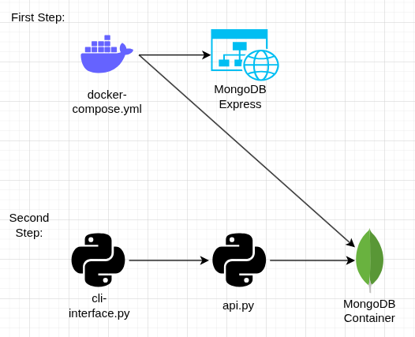

## Getting Started
## 1. Starting up the docker compose containers
- bash: ```docker compose up -d``` -> starts the MongoDB Container & MongoDB Express (WebUI)

- MongoDB on ```localhost:27017```
- MongoDB Express Web UI on ```http://localhost:8081```

## 2. Create a Python virtual environment

From the project root:

```bash
python -m venv .venv
```

Activate it:

```bash
source .venv/bin/activate
```

On Windows PowerShell:

```powershell
.venv\Scripts\Activate.ps1
```

### 3. Install Python dependencies

```bash
python -m pip install --upgrade pip
python -m pip install -r requirements.txt
```

The current dependencies are:

- `pymongo` for MongoDB access
- `uuid` for uuid generation

## Alternative: Nix Development Shell

If you use Nix flakes, you can enter the development environment with:

```bash
nix develop
```

This provides Python with the required packages and `mongosh`.


## Project Architecture


## AI Usage Documentation
- [AI Documentation](docs/ai-documentation.md)
